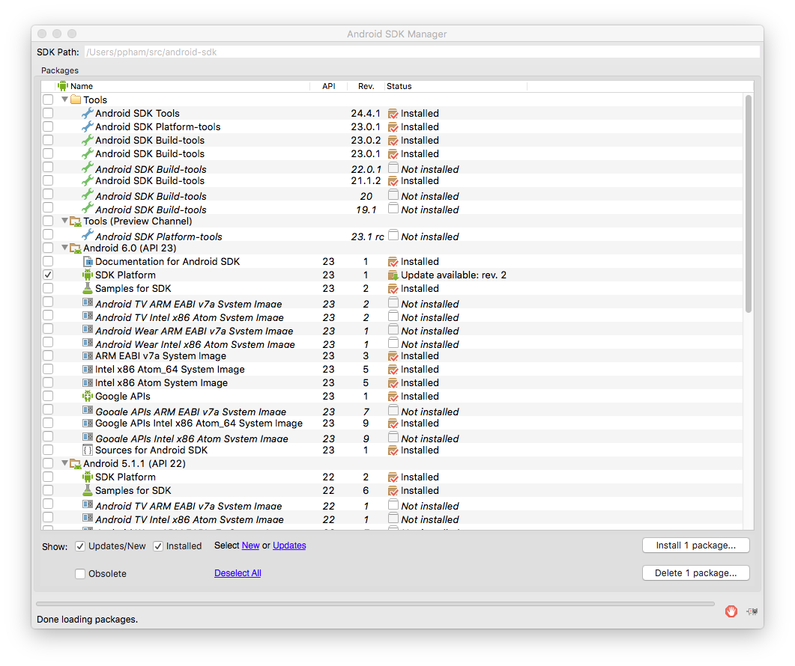
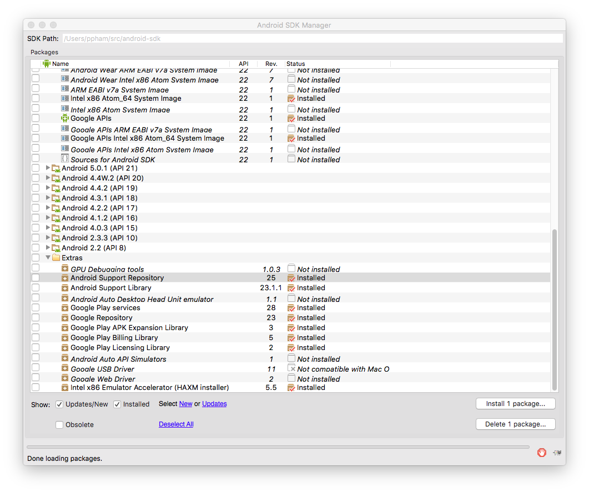

Robot Heart: learn Android
==========================

# Session 0: Write your first Android app

So you want to write an Android app, but you don't know where to start?
We're here to help, mob programming style.
These notes are meant to supplement the first workshop of the
Robot Heart, another fine course from the [Invisible College](http://invisible.college).

# Goals

By the time you're done, you'll have

* a working Android dev environment installed on your computer (running Mac, Windows, or Linux)
* a working "Hello World" Android app that runs in an emulator
* the same app that you can download from the Google Play store.
* understand the basic process of Android development and the terms SDK, API, IDE.

<!--
TODO: waiting to hear back from workshop participant
 It will look like this spiffy Hello World app, written by one of our first workshop participants with his permission (thanks !)
-->

# Software Development Kit

You are probably already a user of Android apps, but you are now entering the hallowed ranks of Android developers. To do this, you'll need extra software to help you develop apps called a Software Development Kit (SDK). An SDK is a collection of 
* libraries (pre-written, pre-packaged functionality that you can include in your own app)
* tools (smaller programs that perform a specific task on your android app)
 * examples: the debug bridge, the monitor, the package manager

Each of the above (libraries and tools) have a particular version that is designed to work with each other, and to target a particular version of Android that is "out in the wild", that is, deployed on people's smartphones and mobile devices.

The process of turning your source code (written in Java, and depending on Android libraries) into an Android app is called *compilation*.

# Application Programming Interfaces

This version is just an agreement between apps, that are written/compiled to depend on certain libraries, and different phones which have those libraries installed and ready-to-use. This version has a fancy name "Application Programming Interface", or API, and is sometimes called a *target* because it is something you aim your development efforts towards (like an arrow).

Android numbers each API, sometimes called an API Level, which developers are exposed to, and these have corresponding version numbers which users see, and also cute codenames that correspond to delicious desserts whose name begin with consecutive letters of the alphabet. Here is a table at the time of this writing (December 2015) (Source: [Android Developer Dashboards](http://developer.android.com/about/dashboards/index.html)).

| Version	| Codename	            | API   | Distribution
|-----------|-----------------------|-------|-------------
| 2.2	    | Froyo	                | 8     | 0.2%
| 2.3.3     | -                     |       |
| 2.3.7     | Gingerbread           | 10    | 3.8%
| 4.0.3     | -                     |       |
| 4.0.4     | Ice Cream Sandwich	| 15	| 3.3%
| 4.1.x     | Jelly Bean            | 16	| 11.0%
| 4.2.x	    | -                     | 17	| 13.9%
| 4.3       | -                     | 18	| 4.1%
| 4.4       | KitKat                | 19	| 37.8%
| 5.0	    | Lollipop	            | 21	| 15.5%
| 5.1       | -                     | 22	| 10.1%
| 6.0       | Marshmallow           | 23    | 0.3%

For these tutorials, we will concentrate on API Level 23, on the assumption that by the time you complete the course, Marshmallow will represent a more sizable fraction of available devices that you will wish to target.

# Pre-work

* Download and install the [http://developer.android.com/sdk/index.html](Android Studio IDE 1.4), which also includes the Android SDK.
* As you are setting up Android Studio, you'll need to select SDK packages to
install. These are the packages you should select:

This may take several minutes and up to an hour, depending on how fast your computer and network connection are. Leave ample time before the workshop to do this step, so that you can be prepared to participate.

# Creating an Empty Project

The simplest app you can think of is one with just a blank screen with some words. By ancient tradition, these words must be "Hello World". Start by running Android Studio and choosing "Create new project".

# Generating an APK

An APK is an Android package file, the actual bits that take up space on your hard drive or SD card. It represents your app and that you'll actually send to other people when you want them to use your app.

It's also the filename extension that you'll see on this file like `robot-heart.apk`

Most of your final users or customers will never see this file. They'll just go to a store to download your app. But while you're in beta (development phase), you may need to distribute your app directly by attaching it to emails, forum posts, Slack chats, on an SD card, USB flash stick, and more. This section will teach you how to create such a file from the Android app that you currently have running inside Android Studio.

# Google Play Store

The final hurdle to unveiling your app to the world is making it available on an online app store. Google's Play Store is the most popular store, so we'll concentrate on that during this tutorial.

Google is the principal company promoting Android development. It also comes pre-installed on all current Android phones. However, Amazon's AppStore is a recent competitor, and one that comes preinstalled on Kindle devices, and more competition is always good for the users. We'll cover the AppStore in later chapters of this book, but the process will follow the same general steps.

## Creating an account

To upload your app, you need to associate it with an account. This will tell your users who you are, and let you control how your app appears in the store. This will also let you collect payments in case you are releasing a paid app.

Normally, Google charges $25 to open a new Google Play Developer account. However, for participating in an Invisible College workshop, you'll receive an email invite to our shared account which will let you practice publishing apps for free. If you haven't received your invitation, contact your instructor.

## Adding a new application

## Filling out the necessary information

### 
