Robot Heart: learn Android
==========================

# Session 0: Write your first Android app

So you want to write an Android app, but you don't know where to start?
We're here to help, mob programming style.
These notes are meant to supplement the first workshop of the
Robot Heart, another fine course from the [Invisible College](http://invisible.college).

# Goals

By the time you're done, you'll have

* a working Android dev environment installed on your computer (running Mac, Windows, or Linux)
* a working "Hello World" Android app that runs in an emulator
* the same app that you can download from the Google Play store.
* understand the basic process of Android development and the terms SDK, API, IDE.

<!--
TODO: waiting to hear back from workshop participant
 It will look like this spiffy Hello World app, written by one of our first workshop participants with his permission (thanks !)
-->

# Software Development Kit

You are probably already a user of Android apps, but you are now entering the hallowed ranks of Android developers. To do this, you'll need extra software to help you develop apps called a Software Development Kit (SDK). An SDK is a collection of 
* libraries (pre-written, pre-packaged functionality that you can include in your own app)
* tools (smaller programs that perform a specific task on your android app)
 * examples: the debug bridge, the monitor, the package manager

Each of the above (libraries and tools) have a particular version that is designed to work with each other, and to target a particular version of Android that is "out in the wild", that is, deployed on people's smartphones and mobile devices.

The process of turning your source code (written in Java, and depending on Android libraries) into an Android app is called *compilation*.

# Application Programming Interfaces

This version is just an agreement between apps, that are written/compiled to depend on certain libraries, and different phones which have those libraries installed and ready-to-use. This version has a fancy name "Application Programming Interface", or API, and is sometimes called a *target* because it is something you aim your development efforts towards (like an arrow).

Android numbers each API, sometimes called an API Level, which developers are exposed to, and these have corresponding version numbers which users see, and also cute codenames that correspond to delicious desserts whose name begin with consecutive letters of the alphabet. Here is a table at the time of this writing (December 2015) (Source: [Android Developer Dashboards](http://developer.android.com/about/dashboards/index.html)).

| Version	| Codename	            | API   | Distribution
|-----------|-----------------------|-------|-------------
| 2.2	    | Froyo	                | 8     | 0.2%
| 2.3.3     | -                     |       |
| 2.3.7     | Gingerbread           | 10    | 3.8%
| 4.0.3     | -                     |       |
| 4.0.4     | Ice Cream Sandwich	| 15	| 3.3%
| 4.1.x     | Jelly Bean            | 16	| 11.0%
| 4.2.x	    | -                     | 17	| 13.9%
| 4.3       | -                     | 18	| 4.1%
| 4.4       | KitKat                | 19	| 37.8%
| 5.0	    | Lollipop	            | 21	| 15.5%
| 5.1       | -                     | 22	| 10.1%
| 6.0       | Marshmallow           | 23    | 0.3%

**For these tutorials, we will concentrate on API Level 22**, on the assumption that by the time you complete the course, Lollipop will represent a more sizable fraction of available devices that you will wish to target. And of course, the author's smartphone right now is running API 22 :smile: 

# Integrated Development Environment

There are several tools that are necessary to develop any program, including an Android app. These are:
* a text editor: the most basic tool in a programmer's arsenal, it lets you create, edit, and save plaintext: characters without any display formatting. Common text editors are Sublime Text, emacs, vi, Atom, Brackets, Notepad++, Programmer's Notepad, Textmate, and TextWrangler.
* a compiler: a tool that converts your plaintext source code into executable binaries or interpretable bytecode.
* a debugger: a tool that lets you stop your program in the middle of execution, inspect its state (including the values of any variables), and step through code. Usually used to find errors (bugs).

Originally, these tools were all separate programs that you had to install, configure, and run yourself, usually from the command-line. This gave you the most control, power, and speed, once you learned all the different commands. However, all of these tools make it difficult to get started and to remember all the different parts. To increase programmer productivity, a new kind of program called an Integrated Development Environment combined all of the functions above into a single program, or more usually, took care of orchestrating the text editor, compiler, and debugger behind-the-scenes for you, so that you as the human programmer could concentrate on the creative, truly difficult aspects of making a greap app.

# Pre-work

* Download and install the [http://developer.android.com/sdk/index.html](Android Studio IDE 1.4), which also includes the Android SDK.
* As you are setting up Android Studio, you'll need to select SDK packages to
install. These are the packages you should select:

This may take several minutes and up to an hour, depending on how fast your computer and network connection are. Leave ample time before the workshop to do this step, so that you can be prepared to participate.

# Creating an Empty Project

The simplest app you can think of is one with just a blank screen with some words. By ancient tradition, these words must be "Hello World". Start by running Android Studio and choosing "Create new project".

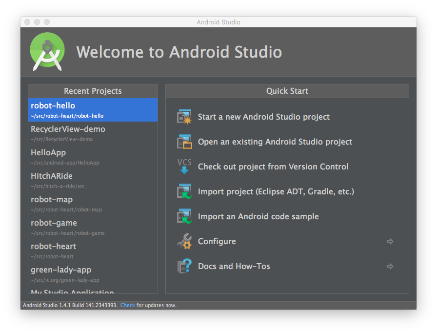
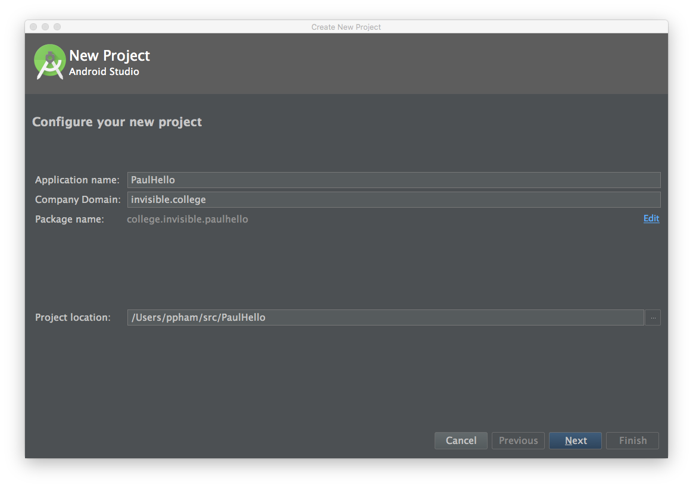
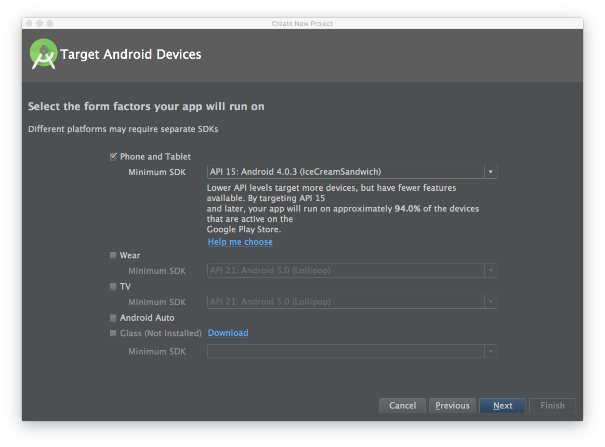

Choose a blank Activity, which is the main building block of an Android app's operation.

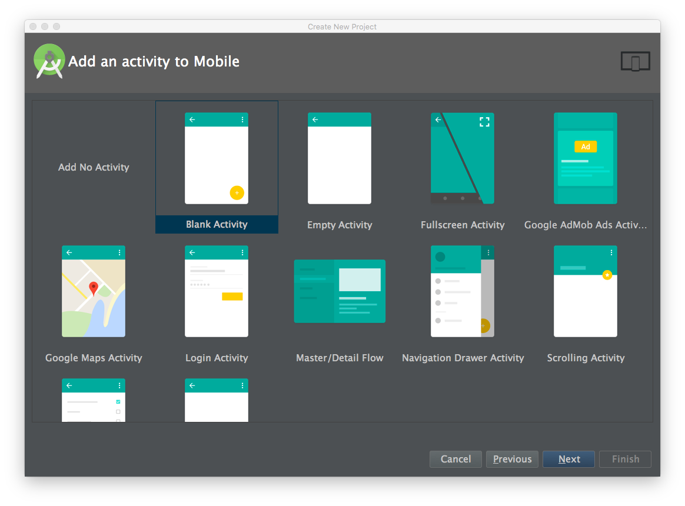

# Generating an APK

An APK is an Android package file, the actual bits that take up space on your hard drive or SD card. It represents your app and that you'll actually send to other people when you want them to use your app.

It's also the filename extension that you'll see on this file like `robot-heart.apk`

Most of your final users or customers will never see this file. They'll just go to a store to download your app. But while you're in beta (development phase), you may need to distribute your app directly by attaching it to emails, forum posts, Slack chats, on an SD card, USB flash stick, and more. This section will teach you how to create such a file from the Android app that you currently have running inside Android Studio.

Make sure that your app has built without errors, and runs correctly the way you intend in the emulator and/or your actual device. If not, go back to a previous section and continue debugging, ask an instructor, or share your screen and ask a classmate on the Slack channel or the next group video chat.

## Start Generating the Build

Within Android Studio, from the `Build` menu, click `Generate Signed APK...`.

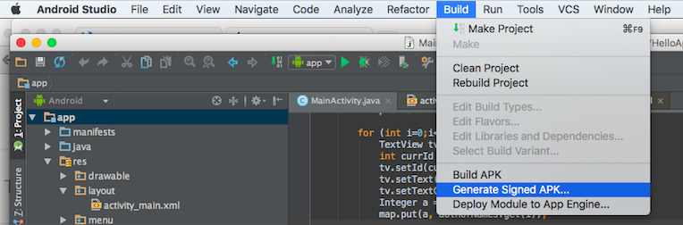

Choose a module (in this case, the default one called `app`) to be the primary one in your app, the one that is the entry point.

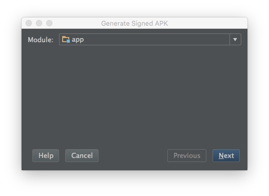

## Keys, Signing, and Passwords

Next, you will need to sign your APK with cryptographic information called a key. Just like a key in real life, a cryptographic key should be kept safe, and only lets the right person (you) access certain items (in this case, the ability to publish an app).

You can have multiple keys for signing different apps, or even different versions of the same app (different modules or different build types). A collection of keys is known as a *keystore*. There are two kinds of passwords associated with publishing apps. Each keystore has a password that protects the entire collection. Within the keystore, each key also has its own password. This prevents someone who has access to your computer from publishing apps under your name without your permission. All of the passwords above should be different from each other. You probably already store a lot of passwords for all the accounts you have at various websites and online services, so you may use a password manager software, like LastPass or 1Password or Keepass. You can use this password manager to keep track of your Android keystore passwords as well. I personally use Evernote, in a single note entitled "Android Keystore Passwords" and encrypt all my keystore and key passwords in it.

If you already have a keystore, perhaps because you've developed other Android apps in the past, you can go head and select that keystore now by navigating to it and selecting the `Choose Existing` button. (You'll need the keystore password from when you created the keystore). It's not necessary to check "Remember passwords" right now, but if you do this a lot in the future, you can check it temporarily to save time.

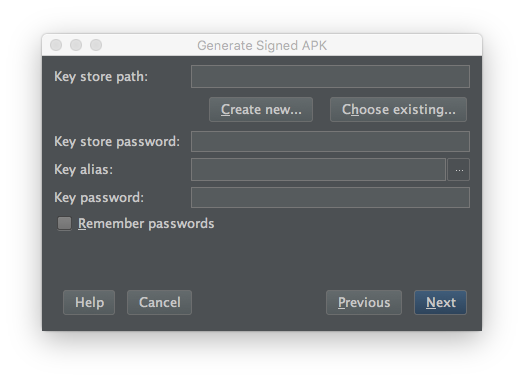

If you don't already have a keystore, because this is your very first time, go ahead and choose the `Create new` button instead.

In either case, you will need to choose a location and filename for either your new keystore or your existing keystore. Clicking the `...` button will bring up a filesystem dialog box that will let you navigate the files on your computer. Type the desired filename at the bottom of the dialog box, and give it a `.jks` filename extension. Then choose `OK`.

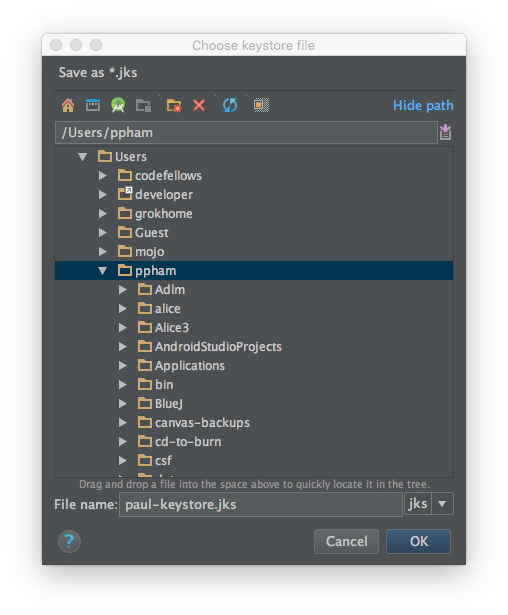

Now that you have a keystore, you will want to create a new key for this app. Fill in the `Alias` and choose another secure password for the `Password` and `Confirm` blanks. Accept the default validity of 25 years, and you can also fill in the default `Organizational Unit`, `Organization`, `City or Locality`, `State of Province`, or `Country Code`. You should of course, fill in your own first and last name to give yourself proper credit.

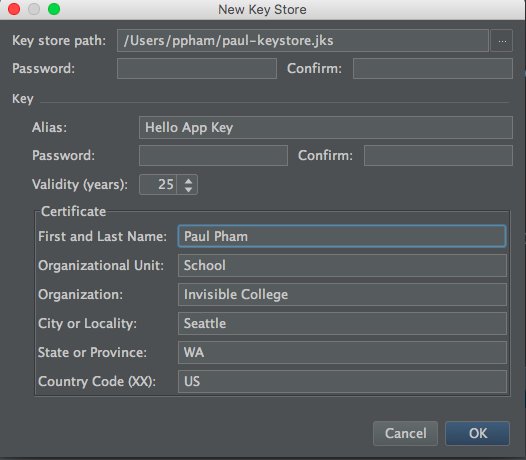

At the end of this process, you'll have a keystore and key chosen, with the correct passwords filled in, which will look like the dialog below.

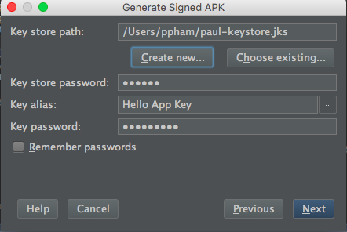

You'll click `Next` to select the build type, which is either `debug` or `release`. Debug builds contain extra information that make it easy to fix errors using the Android monitor and other tools. This is usually what you'll email or give to friends and beta testers. However, to upload to the Google Play Store, you'll need a release build. Don't worry about app flavors for now.

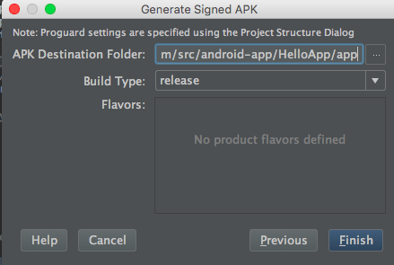

Finally, your app will build as Gradle grinds slowly and deliberately. As it's building, you'll see messages displaying for the target 

# Google Play Store

The final hurdle to unveiling your app to the world is making it available on an online app store. Google's Play Store is the most popular store, so we'll concentrate on that during this tutorial.

Once you have an account, you can just go to the store directly and skip the follow section on Creating an account.

[Google Play Developer Console](play.google.com/apps/publish)

Google is the principal company promoting Android development. It also comes pre-installed on all current Android phones. However, Amazon's AppStore is a recent competitor, and one that comes preinstalled on Kindle devices, and more competition is always good for the users. We'll cover the AppStore in later chapters of this book, but the process will follow the same general steps.

## Legalese

I am not a lawyer, so nothing in this tutorial should be construed as legal advice. Here's where you are going to have to agree to licenses and agreements which may have legal consequences. To publish apps on the Google Play store (or to use pretty much any software these days), you have to agree to a set of rules.

I've read these rules and have decided that they are acceptable in order for me to distribute apps on the Google Play store. But you should also read the rules and decide for yourself, even if you join the Invisible College account, since you are still responsible for apps that you publish.

## Creating an account

To upload your app, you need to associate it with an account. This will tell your users who you are, and let you control how your app appears in the store. This will also let you collect payments in case you are releasing a paid app.

Normally, Google charges $25 to open a new Google Play Developer account. However, for participating in an Invisible College workshop, you'll receive an email invite to our shared account which will let you practice publishing apps for free. If you haven't received your invitation, contact your instructor.

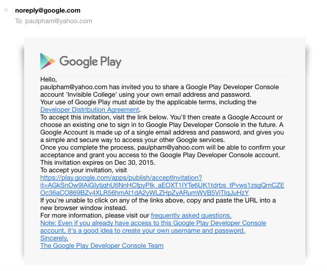

You are of course, welcome to create your own Google Play Account, especially if you are ready to start publishing production-quality apps on your own.

In either case, whether you accept the Invisible College invite or create your own Play developer account, you'll need to log into your Google account. Unfortunately, that means you'll have to create a Google account if you don't already have one (in general, I am opposed to creating new accounts and giving away your personal information if you don't have to).

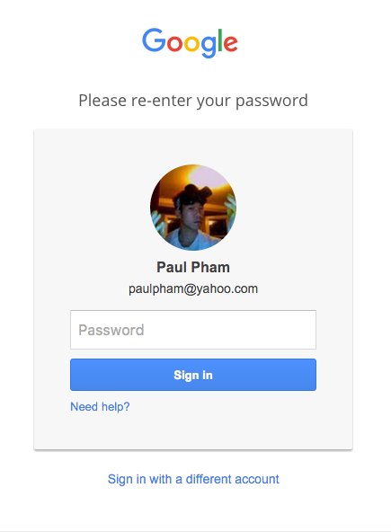

There are now several steps to complete to activate your account.
You should read the Google Play Developer Distribution, which governs the rules under which you can publish apps to the Google Play and your rights and responsibilities. If you agree, check the box and continue. (If you don't agree, unfortunately you can't continue. See legal disclaimer above!)

## Adding a new application

## Filling out the necessary information

### 
